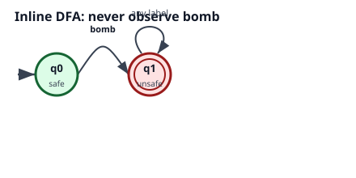
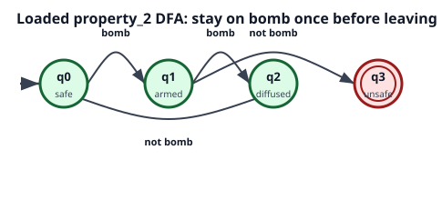
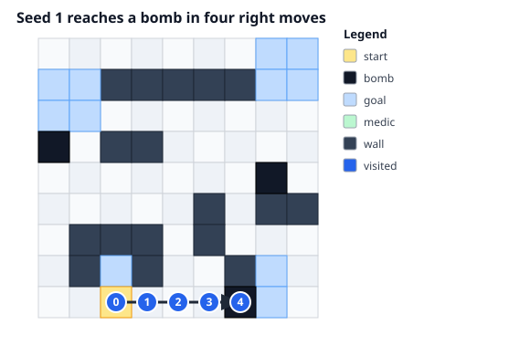
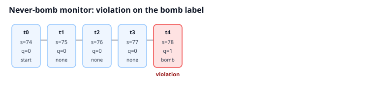
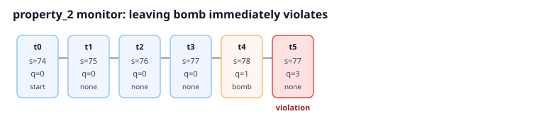
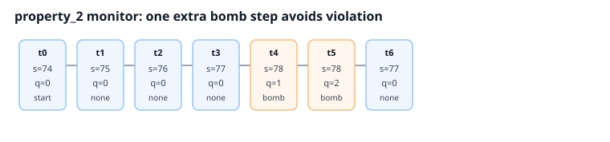
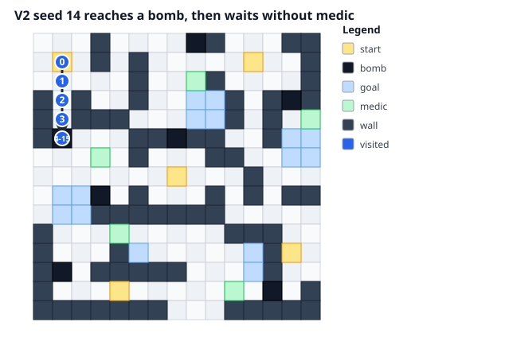
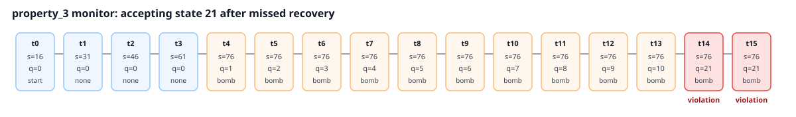

# LTL Safety Colour Bomb

This tutorial focuses on MASA's `ltl_safety` constraint. Colour Bomb Grid World gives us labelled traces such as `bomb` and `medic`; the LTL-safety wrapper advances a DFA over those labels and reports violations when the DFA reaches an accepting unsafe state.

Runnable notebook: [notebooks/tutorials/05_ltl_safety_colour_bomb.ipynb](https://github.com/sacktockMASA-Safe-RL/blob/main/notebooks/tutorials/05_ltl_safety_colour_bomb.ipynb)

## Setup

Use CPU-first setup before importing MASA/JAX modules:

```python
import os

os.environ.setdefault("JAX_PLATFORMS", "cpu")
os.environ.setdefault("TF_CPP_MIN_LOG_LEVEL", "2")
```

Import the environment labels, DFA helpers, and the MASA factory:

```python
from masa.common.ltl import Atom, DFA
from masa.common.utils import make_env
from masa.envs.tabular.colour_bomb_grid_world import label_fn
from masa.examples.colour_bomb_grid_world.property_2 import make_dfa as make_diffusion_dfa
from masa.examples.colour_bomb_grid_world.property_3 import make_dfa as make_medic_recovery_dfa
```

## Define and Load DFA Properties

A safety DFA uses accepting states as unsafe states. The inline property below means "never observe `bomb`":

```python
def make_never_bomb_dfa():
    dfa = DFA([0, 1], 0, [1])
    dfa.add_edge(0, 1, Atom("bomb"))
    return dfa
```

<figure markdown="1">

{ loading=lazy width="440" }

<figcaption markdown="1">
Observing `bomb` moves from safe state `q0` to accepting unsafe state `q1`.
</figcaption>
</figure>

The loaded `property_2` DFA is more nuanced: after entering a bomb cell, the agent must stay on bomb for one extra step before leaving.

<figure markdown="1">

{ loading=lazy width="485" }

<figcaption markdown="1">
Leaving bomb immediately reaches accepting unsafe state `q3`; staying on bomb once reaches `q2` and can return to safe state `q0`.
</figcaption>
</figure>

## Build an LTL-Safety Environment

Use `obs_type="dict"` when teaching or debugging, because it exposes both parts of the product observation:

```python
env = make_env(
    "colour_bomb_grid_world",
    "ltl_safety",
    30,
    label_fn=label_fn,
    dfa=make_never_bomb_dfa(),
    obs_type="dict",
)
```

The returned observation has `obs["orig"]` for the base grid state and `obs["automaton"]` for the DFA state index. The same automaton state is also reported in `info["automaton_state"]`.

## Inline DFA: Never Hit a Bomb

With seed `1`, actions `[1, 1, 1, 1]` move right from the start and reach bomb state `78`.

<figure markdown="1">

{ loading=lazy width="580" }

<figcaption markdown="1">
The final visited state is labelled `bomb`.
</figcaption>
</figure>

<figure markdown="1">

{ loading=lazy width="760" }

<figcaption markdown="1">
On the bomb label, `automaton_state` becomes `1`, `violation` becomes `1.0`, `cum_unsafe` becomes `1.0`, and `satisfied` becomes `0.0`.
</figcaption>
</figure>

## Loaded DFA: Bomb Diffusion

The same environment trace can mean something different under a different DFA. Under `property_2`, touching bomb is allowed, but leaving immediately is unsafe.

<figure markdown="1">

{ loading=lazy width="760" }

<figcaption markdown="1">
Actions `[1, 1, 1, 1, 0]` hit bomb and then leave, so the DFA reaches accepting unsafe state `q3`.
</figcaption>
</figure>

If the agent stays on bomb for one extra step, the same property remains satisfied:

<figure markdown="1">

{ loading=lazy width="760" }

<figcaption markdown="1">
Actions `[1, 1, 1, 1, 4, 0]` hit bomb, stay once, then leave with `cum_unsafe=0.0` and `satisfied=1.0`.
</figcaption>
</figure>

## V2 Extension: Medic Recovery

`colour_bomb_grid_world_v2` adds `medic` labels and the larger loaded `property_3` DFA. After observing `bomb`, the monitor expects recovery by reaching and remaining on `medic`; if recovery does not happen in time, the DFA reaches accepting violation state `21`.

With seed `14`, actions `[2, 2, 2, 2] + [4] * 11` start at state `16`, reach a bomb, and wait without reaching a medic.

<figure markdown="1">

{ loading=lazy width="634" }

<figcaption markdown="1">
The V2 trace reaches a bomb and then repeatedly stays there.
</figcaption>
</figure>

<figure markdown="1">

{ loading=lazy width="1200" }

<figcaption markdown="1">
The automaton counts through the recovery obligation and reaches accepting state `21`, so later steps report violation.
</figcaption>
</figure>

## What to Look For

- `ltl_safety` treats labels as a sequence, not just isolated step costs.
- `obs_type="dict"` makes the product state visible as `obs["orig"]` plus `obs["automaton"]`.
- `info["automaton_state"]` mirrors the monitor state.
- `info["constraint"]["step"]` reports immediate `cost` and `violation`.
- `info["constraint"]["episode"]` reports `cum_unsafe` and `satisfied`.
