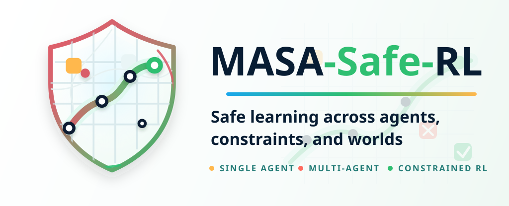

---
hide:
  - toc
---

# MASA-Safe-RL

<div class="masa-hero" markdown="1">

{ .masa-wordmark }

<p class="masa-eyebrow">Single agent · Multi-agent · Constrained RL</p>

[Get started](Get%20Started/Quick%20Start.md){ .md-button .md-button--primary }
[Explore tutorials](Tutorials/Basics.md){ .md-button }

</div>

## Welcome

Welcome to MASA-Safe-RL, the Multi and Single Agent (MASA) Safe Reinforcement Learning library. The primary goal of this library is to develop a set of common constraints and environments for safe reinforcement learning research, built on top of the popular **[Gymnasium API](https://gymnasium.farama.org/)**. We span, CMPDs, probabilistic constraints, Reach-Avoid and LTL-Safety (DFA) properties.  

The library is in very early stage development and we greatly appreciate and encourage feedback from the community about what they would like to see implemented. Currently we provide a set of basic tabular algroithms for safe RL, but we provide a modular and resuable framework for developing more complex algorithms and constraints.


<div class="masa-cards" markdown="1">
<div markdown="1">

**[Build your first experiment](Get%20Started/Basic%20Usage.md)**

Install MASA, understand its core concepts, and run a safe-learning experiment.

</div>
<div markdown="1">

**[Explore the API](Common/Constraints.md)**

Work with constraints, wrappers, temporal logic, and metrics.

</div>
<div markdown="1">

**[Understand shielding](Shielding/Overview.md)**

Explore deterministic and probabilistic approaches to safer action selection.

</div>
</div>

## Organization

The docs are currently organised as follows:

- **Get Started**: installation instructions and core concepts (e.g., labelling function, cost function, make_env).
- **Common API**: API references for common constraints, wrappers, metrics logging and temporal logics used in MASA.
- **Environments**: list of benchmark environments currently provided in MASA.
- **Algorithms**: list of algorithms currently provided in MASA.
- **Shielding**: deterministic and probabilistic shielding approaches are covered.
- **Misc**: auxilliary wrappers, e.g., probabilistic shielding.

We recommend you follow the docs in the provided order starting from **Get Started** to learn about the core concepts in MASA and basic usage.

## Citation

If you use MASA in your research please cite it in your publications.

```bibtex
@misc{Goodall2025MASASafeRL,
  title        = {{MASA-Safe-RL}: Multi and Single Agent Safe Reinforcement Learning},
  author       = {Goodall, Alexander W. and Adalat, Omar and Hamel De-le Court, Edwin and Belardinelli, Francesco},
  year         = {2025},
  howpublished = {\url{https://github.com/sacktock/MASA-Safe-RL/}},
  note         = {GitHub repository}
}
```

## Next Steps
- [Quick Start](Get%20Started/Quick%20Start.md) - Installation instructions for MASA.
